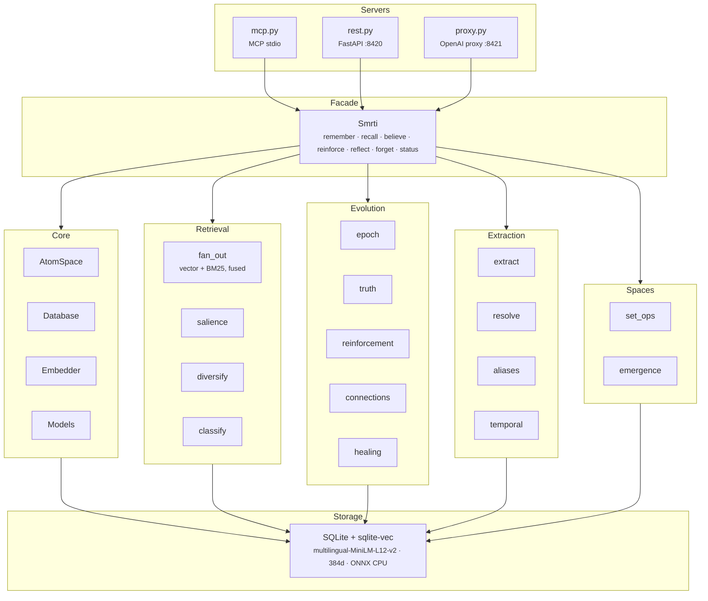

# smrti

[](https://pypi.org/project/smrti/)
[](https://pypi.org/project/smrti/)
[](LICENSE)
[](https://github.com/cyqlelabs/smrti/actions/workflows/ci.yml)
[](https://codecov.io/gh/cyqlelabs/smrti)

**Long-term memory for AI agents in a single SQLite file.** Your agent remembers what matters, forgets what doesn't, and never repeats a critical mistake — no vector database, no external services, no infrastructure.

Inspired by <a href="https://github.com/opencog/atomspace" target="_blank">AtomSpace</a>: memories are graph nodes with truth values, attention weights, and emotional valence. Retrieval fuses vector and lexical search, expands one hop through the relations extracted from what you stored, and ranks by relevance scaled by standing — attention (STI/LTI), confidence built from evidence, and the tone a memory was written with — under a personality that decides how much each counts. Relevance gates the rest: nothing outranks a memory about the question because it is important elsewhere. Consolidation runs when the agent is used, not when the clock ticks, and decays, promotes, supersedes and prunes what it holds.

- [Install](#install)
- [Quick Start](#quick-start)
- [Use with Claude / MCP clients](#mcp-server)
- [How It Works](#how-it-works)
- [Server Modes](#server-modes)
- [Configuration Reference](#configuration-reference)
- [Security & Monitoring](#security--monitoring)
- [Multi-Tenant / Space Model](#multi-tenant--space-model)
- [Personality System](#personality-system)
- [Architecture](#architecture)

## Why smrti

- **Zero infrastructure** — one SQLite file with [sqlite-vec](https://github.com/asg017/sqlite-vec) for KNN and ONNX embeddings on CPU. `pip install` and go.
- **Error-avoidance memory** — severe failures get a long-term-importance floor so they survive pruning, and recall dynamically boosts them: old-but-critical errors outrank recent trivia. Recalled memories are classified as `critical_warning`, `known_antipattern`, or `context`. Only a failure stored with an explicit negative valence becomes a hard constraint, so ordinary frustration in stored conversation never turns into a rule the agent has to obey.
- **Automatic knowledge graph** — a hybrid GLiNER2 + LLM pipeline extracts entities and typed relations from everything you store, and resolves pronouns against the persisted graph — no manual schema.
- **Three integration paths** — MCP server for Claude and other LLM clients, REST API, or an OpenAI-compatible proxy that adds memory to any existing app by changing one base URL.
- **Multilingual** — 50+ languages end-to-end (multilingual embeddings, zero-shot NER, language-agnostic sentiment). No English-only heuristics anywhere.
- **Personality-driven** — six presets (17 tunable hyperparameters) shape what each agent notices, retains, and forgets. The same history produces different memories in different agents.

## Install

```bash
pip install smrti
```

### Container

Same package as `pip install smrti`, with the embedding model bundled so a fresh container recalls offline instead of stalling on a first-run download.

```bash
docker run -d -p 8420:8420 -v smrti-data:/data ghcr.io/cyqlelabs/smrti
```

That serves the REST API. Any other command replaces it, and every environment variable in the [configuration reference](#configuration-reference) works as usual:

```bash
docker run -d -p 8421:8421 -v smrti-data:/data \
  -e SMRTI_UPSTREAM_URL=http://host.docker.internal:11434/v1 \
  -e SMRTI_API_KEY=your-key \
  ghcr.io/cyqlelabs/smrti serve proxy --host 0.0.0.0 --port 8421
```

- **Tags** — every `v*` release publishes `latest`, the exact version, and a rolling `MAJOR.MINOR`; pin whichever you want to track.
- **Storage** — `/data` holds the database and the NER weights that download on first extraction; mount a volume or both die with the container.
- **User** — runs as non-root `smrti`.

### Upgrading

An existing database is brought up to date the first time the new version opens it, with a `.pre-migration.bak` snapshot written beside it first (restore that file to downgrade). Schema additions run as migrations; three data repairs run as well, each idempotent, so they also mend rows an older process writes later:

- Extracted entities written before every creation path set the intrinsic tone get it rebuilt from their claim edges, so they stop being judged on the mood they absorb from their neighbours.
- The placeholder `associated` edges the old healing step drew out of every person atom are removed.
- Atoms forgotten by the old `forget()`, which left them at the surfacing floor, are sunk below it so the pruner can take them.

Bridge spaces the old consolidation epoch materialised on its own (`a_x_b`) are left in place; clear one with `DELETE /spaces/current?space=a_x_b` if nothing reads it.

## Quick Start

### Python API

```python
from smrti import Smrti

mem = Smrti(db_path="~/.smrti/memory.db", personality="balanced")

# Store memories
mem.remember("Alice prefers TypeScript", probability=0.9, valence=0.3)
mem.remember("The deploy pipeline is broken", probability=0.95, valence=-0.7)

# Recall by semantic similarity + salience
results = mem.recall("programming languages")
for r in results:
    print(f"{r.atom.label} (salience={r.salience:.2f}, confidence={r.atom.truth.confidence:.2f})")

# Assert a belief with evidence
mem.believe("Python is the best language for ML", probability=0.85, evidence="Team survey results")

# Consolidate: decay, promote, prune, resolve contradictions
epoch = mem.reflect()
print(f"Updated {epoch.beliefs_updated} beliefs, pruned {epoch.atoms_pruned} atoms")

mem.close()
```

### CLI

```bash
smrti init --db ~/.smrti/memory.db --personality balanced   # create a database
smrti status                                                # inspect it

smrti serve mcp     # MCP stdio server (Claude, etc.)
smrti serve rest    # REST API on :8420
smrti serve viz     # REST API + memory visualizer in the browser
smrti serve proxy   # OpenAI-compatible proxy on :8421
smrti serve town    # city-builder simulation demo on :8430 (needs a repo checkout)

smrti stop          # gracefully stop all servers started by `smrti serve`
smrti stop rest     # stop one mode (rest, viz, proxy, town); --port to narrow further
```

## How It Works

> [Full pipeline diagram →](docs/pipeline.md)

**`remember()`** — Embeds and stores text as a typed atom (concept, belief, episode, or goal) with a truth value, attention weight, and valence. Leave `valence` unset and it is read from the text; pass one and the memory is filed as a deliberate report, which is what lets recall raise it to a behavioral constraint. `intensity` is how strongly the tone is felt, a separate dimension you can state; left unset it is `|valence|`. `type="belief"` is `believe()`: one atom per kind whichever door it came through, born unsure at confidence 0.3 and earning more through evidence, or born certain when asserted at probability ≥ 0.95 — a permanent belief keeps the confidence it was asserted with and is exempt from decay. The `evidence` you give `believe()` is recorded on the evidence log, so a belief can list why it is believed (`evidence(atom_id)`), not only how confident the engine has become. Relative dates are resolved against the moment you write them, so "the session is tomorrow" still names a day when you read it next week — on in every server mode, and `Smrti(temporal=True)` for a direct caller, since it costs an NER pass per write; the resolutions are filed in one place, which the extraction model adds to but never overwrites. Entities and relation edges are extracted automatically (the LLM is only called when GLiNER finds ≥2 entities, cutting LLM calls ~40–60%), and a claim that replaces an earlier one about the same subject — a new city, a new employer, a changed preference — is recorded as superseding it.

**`recall()`** — Searches twice and fuses the results: a vector KNN over the query embedding beside a BM25 search of the same spaces, merged by Reciprocal Rank Fusion. The lexical half earns its place on the queries the embedding gets wrong — a fact stored in one language sits a long way from the question that asks for it in another, while the proper nouns both carry are identical. Only its top ten candidates join the pool: that head holds the proper-noun matches, and its tail is every atom sharing a stop-word with the query. Fusion only chooses the candidates; salience decides the ranking, after 1-hop graph expansion:

```
S = similarity × ( w_sim + w_sti × sti + w_conf × confidence + w_lti × lti + w_val × |valence| × intensity )
```

Relevance gates standing. The four standing terms say how much the graph has come to trust an atom; similarity says how much it is about the question, and the two multiply rather than add, so an atom that is not about the question cannot be salient to it however important it is otherwise, and among atoms that are, standing decides the order. (Added, they let a well-connected person concept at similarity zero outrank every episode that answered.) When valence < −0.5, weight shifts dynamically from STI to valence so critical errors outrank recent trivia. The valence terms read the tone an atom was written with, never the mood it absorbed from its neighbors during propagation. An episode that is a copy of the query scores nothing — the question is not the answer. `agent_source_trust` discounts the standing an agent-authored atom has earned but leaves similarity alone: on equal relevance the user's version wins, and a question only the model's own reply can answer still gets answered. A last pass caps how much of the answer one moment may fill: an episode repeating one already chosen from the same minutes yields its slot once that moment has spent its allowance, which is two repeats or one per six slots of answer, whichever is larger. Beliefs keep a couple of slots either way, so the standing facts survive a wall of chatter. Results below the personality's `min_confidence_to_surface` are excluded unless you pass your own floor; a memory you asked to forget is excluded at any floor. Each result carries a severity classification (`critical_warning`, `known_antipattern`, or `context`); a critical warning takes a valence you set yourself, on an atom that can hold a proposition — never a bare concept — and a known antipattern is a belief whose probability has fallen below 0.3, which is where a superseded preference or constraint ends up.

**`forget()`** — Stops the memories matching a query from surfacing. Their confidence is sunk below the surfacing floor, they are stamped so that no recall returns them at any floor and no consolidation lifts them back, and the long-term floors that exempt user testimony from pruning are released, so the next epoch may remove them. Finding them boosts nothing: forgetting a memory must not make it more prominent.

**`reinforce()`** — Reports that memories were used, which is the one way confidence climbs without the caller restating the fact. Everything else rides it down toward the surfacing floor, and an atom below that floor can never be recalled, so it can never be restated, so nothing lifts it back. The client decides what "used" means — the cheap proxy is that distinctive words from a recalled atom turned up in the reply it informed. The evidence is weak on purpose: a small weight, an update that converges rather than ratchets, a cap per consolidation, the agent-source discount, and never a memory you asked to forget.

**`reflect()`** — One consolidation epoch. The servers run one every `SMRTI_REFLECT_INTERVAL` seconds (default 60) for each space that was *used* during the interval — an idle space, served or not, does not age, so an epoch is a unit of the agent's activity rather than of the server's uptime. It revises pending evidence (the count-based PLN revision rule: confidence is an evidence count, and every observation adds to it), decays attention and confidence, propagates both to neighbors, heals orphaned episodes, promotes high-STI atoms to long-term importance, resolves contradictions — a superseded claim is cut to probability 0.1 and loses confidence — and prunes what has fallen below the floors. User-stated episodes and beliefs decay only as far as the surfacing floor — direct testimony never stops being recallable, unless you forgot it — while concepts, goals, and everything agent-authored keep fading. The personality profile governs every weight and threshold. Every atom also carries provenance (`user` vs `agent`): model-authored content decays faster and gets a lower long-term-importance floor, so what you told the agent outlives what it inferred.

## Server Modes

### MCP Server

Exposes 8 tools over stdio for direct LLM integration.

**Claude Code:**

```bash
claude mcp add smrti -- smrti serve mcp
```

**Claude Desktop** (or any MCP client) — add to your MCP config:

```json
{
  "mcpServers": {
    "smrti": {
      "command": "smrti",
      "args": ["serve", "mcp"],
      "env": { "SMRTI_DB": "~/.smrti/memory.db" }
    }
  }
}
```

| Tool                  | Description                                                                                       |
| --------------------- | ------------------------------------------------------------------------------------------------- |
| `smrti_remember`      | Store an episode, goal, or belief (use `type=belief` + `evidence` to assert a probabilistic fact) |
| `smrti_recall`        | Semantic search with salience scoring and severity classification                                 |
| `smrti_reflect`       | Run a consolidation epoch                                                                         |
| `smrti_forget`        | Lower confidence on a memory                                                                      |
| `smrti_status`        | Memory statistics and the tenant's spaces                                                         |
| `smrti_personality`   | Get or set the personality preset                                                                 |
| `smrti_space_query`   | Compare two spaces: `op=overlap` (Jaccard), `op=intersection`, `op=diff`                          |
| `smrti_space_merge`   | Materialize a bridge space from the overlap between two spaces                                    |

### REST API

Full CRUD over HTTP on port 8420:

```bash
smrti serve rest --host 0.0.0.0 --port 8420
```

```bash
# Store a memory
curl -X POST http://localhost:8420/remember \
  -H "Content-Type: application/json" \
  -d '{"content": "Alice prefers TypeScript", "probability": 0.9}'

# Recall
curl -X POST http://localhost:8420/recall \
  -d '{"query": "programming languages", "top_k": 5}'

# Report that recalled memories shaped the reply — being used builds confidence
curl -X POST localhost:8420/reinforce \
  -H 'Content-Type: application/json' \
  -d '{"atom_ids": ["4f2c…", "9ab1…"]}'

# Run consolidation
curl -X POST http://localhost:8420/reflect

# Get status
curl http://localhost:8420/status

# Compare two spaces (op = overlap | intersection | diff)
curl -X POST http://localhost:8420/space_query \
  -d '{"op": "overlap", "other_space": "personal"}'

# Grow a bridge space from what two spaces share
curl -X POST http://localhost:8420/space_merge \
  -d '{"other_space": "personal", "min_jaccard": 0.1}'
```

Every endpoint takes an optional `space` to route the call; `/space_query` and
`/space_merge` compare that space with `other_space` and refuse a self-compare.

### OpenAI-Compatible Proxy

The fastest way to add memory to an existing app: point your OpenAI client at the proxy and keep everything else the same. It intercepts each chat request, injects relevant memories into the system prompt, and stores the exchange afterward.

```bash
smrti serve proxy --host 0.0.0.0 --port 8421 --upstream https://api.openai.com
```

```python
from openai import OpenAI

client = OpenAI(
    base_url="http://localhost:8421/v1",
    api_key="sk-..."  # forwarded to upstream
)

response = client.chat.completions.create(
    model="gpt-4o",
    messages=[{"role": "user", "content": "What do you know about Alice?"}],
    extra_headers={
        "X-Smrti-Tenant-Id": "user_123",
        "X-Smrti-Write-Space": "work",
        "X-Smrti-Read-Spaces": "work,personal",
    }
)
```

On every request the proxy:

1. Recalls relevant memories from the read spaces, building the query from recent conversation context (not just the last message)
2. Injects them into the system prompt in two sections — behavioral constraints (`YOU MUST NOT` / `AVOID`) for `critical_warning` and `known_antipattern` memories, and background context (`Note:`) for the rest — each with a confidence qualifier
3. Stores the user message and assistant response as episodes (identical episodes are deduplicated per tenant/space)
4. Extracts entities and claims into concept nodes and typed relation edges

Works with any OpenAI-compatible upstream — including local llama.cpp, vLLM, or Ollama endpoints.

### Memory Visualizer

`smrti serve viz` opens a browser-based graph explorer to inspect atoms, relations, and attention weights, plus an **LLM Calls** debug tab showing every extraction request with full request/response, timing, and recalled memories.

[](docs/visualizer.png)

## Configuration Reference

All server modes read the same environment variables. Everything works with zero configuration; set these to customize.

**Core (all modes):**

| Variable                 | Default              | Purpose                                            |
| ------------------------ | -------------------- | -------------------------------------------------- |
| `SMRTI_DB`               | `~/.smrti/memory.db` | Database file path                                 |
| `SMRTI_PERSONALITY`      | `balanced`           | Personality preset                                 |
| `SMRTI_TENANT_ID`        | `default`            | Tenant partition (hard isolation)                  |
| `SMRTI_SPACE`            | `default`            | Write space                                        |
| `SMRTI_READ_SPACES`      | write space          | Comma-separated spaces to read from                |
| `SMRTI_REFLECT_INTERVAL` | `60`                 | Consolidation interval in seconds (0 = off); each interval runs one epoch for every space used during it, none for an idle space |
| `SMRTI_RUN_DIR`          | `~/.smrti/run`       | Where `smrti serve` writes PID files so `smrti stop` can find its servers |
| `SMRTI_IGNORE_PATTERNS`  | —                    | Newline-separated regexes; matching content is dropped before storage (see below) |

**Security (REST / proxy / viz):**

| Variable             | Default | Purpose                                                                                  |
| -------------------- | ------- | ---------------------------------------------------------------------------------------- |
| `SMRTI_API_KEY`      | —       | When set, every request must send `Authorization: Bearer <key>` or `X-Api-Key: <key>`    |
| `SMRTI_CORS_ORIGINS` | —       | Comma-separated allowed origins for the proxy; CORS middleware is only added when set    |
| `SMRTI_VIZ_DBS`      | —       | Extra SQLite paths (`:`-separated) the visualizer's DB box may open; by default only the server's own database is browsable |

**Proxy:**

| Variable                      | Default                  | Purpose                                                  |
| ----------------------------- | ------------------------ | -------------------------------------------------------- |
| `SMRTI_UPSTREAM_URL`          | `https://api.openai.com` | Upstream OpenAI-compatible API                           |
| `SMRTI_RECALL_TOP_K`          | `5`                      | Memories to inject per request                           |
| `SMRTI_RECALL_MIN_CONFIDENCE` | personality floor        | Confidence floor for injected memories; unset means the preset's `min_confidence_to_surface` |
| `SMRTI_QUERY_MODE`            | `concat`                 | Recall query source: `concat` recent context or `last` message only |
| `SMRTI_QUERY_CONTEXT_MSGS`    | `5`                      | Recent messages included in the recall query             |
| `SMRTI_QUERY_MAX_CHARS`       | `500`                    | Max characters of the recall query                       |
| `SMRTI_INJECT_MAX_CHARS`      | `500`                    | Max characters per injected memory                       |

**Extraction (all modes):**

| Variable                 | Default                    | Purpose                                                          |
| ------------------------ | -------------------------- | ---------------------------------------------------------------- |
| `SMRTI_EXTRACT`          | `1`                        | Entity/claim extraction after every `remember` (0 = off)         |
| `SMRTI_EXTRACT_MODE`     | `hybrid`                   | `hybrid` (GLiNER + LLM), `llm` (LLM-only), `local` (no LLM)      |
| `SMRTI_EXTRACT_URL`      | proxy upstream, else unset | LLM endpoint for extraction calls. `serve rest` and `serve mcp` have no upstream to inherit, so leaving it unset runs extraction in `local` mode rather than calling out to an endpoint you did not choose |
| `SMRTI_EXTRACT_MODEL`    | request model              | Model for extraction calls                                       |
| `SMRTI_EXTRACT_THINKING` | `disabled`                 | Chain-of-thought for extraction: `disabled` is faster and avoids token-budget exhaustion on thinking models (Qwen3, DeepSeek-R1); also `auto`, `enabled` |
| `SMRTI_EXTRACT_TIMEOUT`  | `60`                       | Extraction request timeout in seconds                            |
| `SMRTI_NER_MODEL`        | `lmo3/gliner2-multi-v1-onnx` | GLiNER2 ONNX export for local zero-shot NER — runs on ONNX Runtime, so no PyTorch and no AVX/SSE4.1 floor |
| `SMRTI_TEMPORAL`         | `1`                        | Resolve relative dates against the write time as memories are stored (0 = store text verbatim). Costs one NER pass per write |

### Ignoring Automated Messages

Agentic frameworks often produce periodic system messages (heartbeat checks, status pings, tool scaffolding) that should not pollute memory. Any `remember()` call matching `SMRTI_IGNORE_PATTERNS` is silently dropped before embedding or extraction:

```bash
export SMRTI_IGNORE_PATTERNS="^# Heartbeat Check
^HEARTBEAT_OK$"
```

Patterns are matched with `re.search` (anchors optional) and apply to all server modes.

## Security & Monitoring

**API key auth** — HTTP servers are open by default for local use. Set `SMRTI_API_KEY` to require a key on every REST, proxy, and visualizer request (`Authorization: Bearer <key>` or `X-Api-Key: <key>`). The CLI warns when you bind to a non-loopback host without a key set.

**Prometheus metrics** — REST and proxy expose `GET /metrics` in Prometheus text format, with zero extra dependencies. Gauges include `smrti_atoms_total`, `smrti_atoms_by_type`, `smrti_epoch_count`, and the active personality hyperparameters, all labeled by `tenant` and `space` — so you can alert per tenant (e.g. "atom count flatlined → `remember` is failing") and track personality drift from Grafana or any Prometheus-compatible system.

## Multi-Tenant / Space Model

**Tenants** are hard walls: atoms, embeddings, and attention weights never cross them. **Spaces** are permeable layers within a tenant: you write to one, read from many, and each has its own personality and consolidation cycle.

```python
researcher = Smrti(tenant_id="team", write_space="researcher",
                   read_spaces=["researcher", "shared"], personality="curious")
deployer   = Smrti(tenant_id="team", write_space="deployer",
                   read_spaces=["deployer", "shared"], personality="deterministic")
coordinator = Smrti(tenant_id="team", write_space="coordinator",
                    read_spaces=["coordinator", "shared", "researcher", "deployer"],
                    personality="analytical")
shared = Smrti(tenant_id="team", write_space="shared")
```

Each space consolidates independently. The researcher forgets fast; the deployer holds onto critical failures; the coordinator sees everything but filters through its own lens. Over time each agent develops a different understanding of the same shared history.

Things people build with this: agent teams with private working memory and shared project context, multi-agent simulations where each agent remembers the same event differently, and role-based perspectives for the same user across contexts.

Spaces also support set-theory operations — overlap, intersection, difference, union, symmetric difference — and can materialize **bridge spaces** from the overlap between two spaces. Reachable as the `space_query` and `space_merge` MCP tools and as the `POST /space_query` and `POST /space_merge` REST endpoints. A bridge is grown only when you ask for one; the consolidation epoch never compares spaces on its own.

## Personality System

Six built-in presets control retrieval behavior, decay rates, and emotional dynamics:

| Preset          | Bias                                       | Use Case                                 |
| --------------- | ------------------------------------------ | ---------------------------------------- |
| `balanced`      | Equal weights across all signals           | General-purpose agents                   |
| `analytical`    | High confidence weight, low valence        | Logical reasoning, data-driven decisions |
| `curious`       | High STI weight, fast decay                | Exploration, novelty-seeking             |
| `empathetic`    | High valence weight, emotional propagation | Relationship-focused agents              |
| `maverick`      | Slow decay, high propagation               | Independent, contrarian reasoning        |
| `deterministic` | Fast learning, slow decay, laser focus     | Agentic workflows, code gen, deployments |

Each preset tunes 17 hyperparameters. To create a custom personality, start from a preset and override individual values via the `personality` DB table or the `/personality` API endpoint.

<details>
<summary><strong>Hyperparameter reference</strong> (17 parameters, defaults from the <code>balanced</code> preset)</summary>

**Salience weights** — control how retrieval ranks results (should sum to ~1.0):

| Parameter | Default | Effect |
|-----------|---------|--------|
| `w_similarity` | 0.35 | Weight of embedding cosine similarity |
| `w_sti` | 0.25 | Weight of short-term importance (recency/access) |
| `w_confidence` | 0.20 | Weight of truth value confidence |
| `w_lti` | 0.10 | Weight of long-term importance |
| `w_valence` | 0.10 | Weight of emotional intensity (dynamically boosted when valence < -0.5) |

**Belief dynamics** — govern how confidence evolves over time:

| Parameter | Default | Effect |
|-----------|---------|--------|
| `confidence_decay_rate` | 0.02 | Per-epoch confidence decay. Higher = memories fade faster. An epoch runs once per reflect interval in which the space was used |
| `confidence_update_lr` | 0.3 | How many evidence units one observation is worth, times its weight. Higher = new evidence moves the belief further |
| `min_confidence_to_surface` | 0.1 | Floor below which atoms are excluded from recall results when the caller passes no floor of its own, and below which user testimony stops decaying |

**Attention dynamics** — control what stays in focus:

| Parameter | Default | Effect |
|-----------|---------|--------|
| `sti_decay_rate` | 0.1 | Per-epoch STI decay. Higher = faster attention loss |
| `sti_boost_on_access` | 0.5 | STI added each time an atom is recalled. Higher = stronger recency bias |
| `sti_propagation_factor` | 0.15 | Fraction of STI boost propagated to linked atoms. Higher = broader activation |
| `lti_promotion_threshold` | 0.7 | STI above which an atom's LTI is raised to half its STI (never lowered). Higher = harder to earn long-term importance |
| `lti_decay_rate` | 0.01 | Per-epoch LTI decay. Higher = long-term importance erodes faster |

**Provenance** — weighs what the agent wrote against what the user said:

| Parameter | Default | Effect |
|-----------|---------|--------|
| `agent_source_trust` | 0.5 | Standing of agent-authored atoms. Discounts every salience term but similarity at recall, and accelerates their decay; lower = model output fades faster while user-stated facts persist |

**Emotional dynamics** — shape how valence influences behavior:

| Parameter | Default | Effect |
|-----------|---------|--------|
| `valence_weight` | 0.2 | Strength of the weight shift from STI to valence for severely negative memories |
| `valence_propagation` | 0.1 | Fraction of valence propagated to linked atoms during epochs. Propagation moves an atom's *mood* (the `valence` a recall result reports), never the tone it was written with, which is what the engine's own judgements read; the mood is for callers that want to know how a memory feels now — a citizen in smrti-town avoids a place its memories have soured on |
| `mood_inertia` | 0.8 | Resistance to mood shifts (0 = reactive, 1 = stable) |

</details>

## Architecture



**Retrieval pipeline:** Embed query → KNN over tenant partition, fused by Reciprocal Rank Fusion with the top ten hits of a BM25 search of the same spaces (entry pool scales with graph size) → filter to read spaces → 1-hop graph expansion, highest-standing endpoints first → salience scoring (relevance × standing) → diversity cap → top-k

**Consolidation epoch** (one per `SMRTI_REFLECT_INTERVAL` for each space used during it, or manually via `reflect()`):

1. Revise pending evidence (count-based PLN revision)
2. Decay STI, LTI, and confidence (user-stated episodes and beliefs stop at the surfacing floor; permanent beliefs do not decay; forgotten atoms hold no floor)
3. Propagate STI and valence to 1-hop neighbors
4. Heal orphaned episodes (link to the sole person, or to the one person the episode names)
5. Promote high-STI atoms to LTI
6. Resolve contradictions (a superseded claim is cut to probability 0.1 and loses confidence; an unnamed contradiction weakens the less confident side)
7. Discover associations between similar high-LTI atoms that are not yet linked (every 10th epoch)
8. Prune atoms below confidence/LTI floors

Bridge spaces are grown only when asked (`space_merge`), never by the epoch.

## Data Model

| Atom Type  | Purpose                  | Example                          |
| ---------- | ------------------------ | -------------------------------- |
| `concept`  | Reusable entities        | "Alice", "Python", "OpenAI"      |
| `belief`   | Probabilistic facts      | "Alice prefers TypeScript"       |
| `episode`  | Timestamped observations | "User asked about deployment"    |
| `goal`     | Desired states           | "Finish the migration by Friday" |
| `relation` | Edges between atoms      | Alice → works_at → Acme Corp     |

Each atom carries:

- **TruthValue** — `probability` [0,1] and `confidence` [0,1]. Confidence is an evidence count in disguise (`c = n / (n + 1)`), and every observation — a stated reason, a re-mention, a report of use, a supersession — is revised in by the same count-based rule (PLN revision, `k = 1`). For episodes and concepts, which hold no proposition, confidence is retention strength: it gates surfacing rather than truth. Every kind of atom is born at one confidence (`INITIAL_CONFIDENCE`), whatever path created it
- **AttentionValue** — `sti` (short-term importance, decays fast) and `lti` (long-term, accumulates)
- **Valence** — emotional tone [-1,1] and intensity [0,1], kept as two pairs: the tone the atom was written with, which everything judging the memory reads, and the current mood, which propagation moves toward its neighbors each epoch and which a recall result reports as `valence`
- **Evidence** — an append-only log of observations: the probability observed, its weight, who reported it, and what it was (`text`)

## smrti-town

A living demo: [smrti-town](src/smrti_town/README.md) is a city-builder where every citizen carries a persistent smrti memory graph. You place the Town Hall and choose a mayor; an LLM-generated council debates what to build, citizens immigrate, work, and petition — and every decision they make is driven by what they remember.

```bash
smrti serve town   # simulation + frontend on :8430
```

The published package ships `smrti` only, so this one command needs the repo: clone it and `pip install -e .`.

## Testing

```bash
pytest tests/ -v
```

## Benchmarks

Two harnesses live in `bench/`, each ingesting a published dataset as episodes and answering its questions through `recall`. Retrieval and answering are scored separately on purpose: a strong answering model can carry a weak candidate set, and that is exactly the regression a gate exists to catch.

Measured on 2026-08-26 — smrti as a pure vector + BM25 store: extraction off, no consolidation epochs, `top_k=50`, `deterministic` preset, gemini-3.7-flash answering and judging. In that configuration every atom has zero attention and a constant confidence, so the numbers measure the retrieval half alone. They also predate the ranking change that scales standing by relevance; re-run `make bench` before reading them against the current engine.

| Benchmark | Scope | Retrieval | Answers | Notes |
| --------- | ----- | --------- | ------- | ----- |
| [LongMemEval-S](https://github.com/xiaowu0162/LongMemEval) | 40 questions, one per ability in turn | **0.975** hit · 0.912 evidence recall | **0.900** | 5 of 6 abilities retrieve without a miss |
| [HaluMem](https://huggingface.co/datasets/IAAR-Shanghai/HaluMem) | 3 personas, 180 questions | — | **0.517** correct | hallucination 0.394 · omission 0.089 |

```bash
make datasets        # fetch both into data/ (265MB + 32MB, once)
make bench           # fails if the retrieval hit rate drops
make bench-halumem   # fails if the hallucination rate rises

# add --extract-url/--extract-model to either to build the entity graph
# add --epochs N to consolidate each history N times before querying it
# add --top-k 5 to measure at the proxy's injection budget (10 for the MCP tool)
```

Each benchmark locks its config (model, `top_k`, personality, subset) beside a recorded baseline, and refuses to compare numbers measured under different configs; `--epochs` and `--top-k` enter the fingerprint when set, so a run under either mode is reported on its own rather than gated against a baseline that never ran them. Subsets are deterministic and balanced across question types — the datasets are grouped by ability, so the front of a file is one skill many times over. Neither is a CI gate: they need the datasets, the embedding model, and a judge key.

### What the numbers say

**Where it is strong.** LongMemEval retrieves the annotated evidence for five of six abilities without a miss, and temporal reasoning and the assistant's-own-words questions convert that into perfect answers. On HaluMem's *memory boundary* questions — asked about things the user never said — smrti answers correctly 97% of the time and invents something 2.9% of the time. Knowing what you were not told is the hard half of remembering.

**Where it is weak.** HaluMem's synthesis categories hallucinate badly: dynamic update 71%, multi-hop inference 63%, generalization 62%. And smrti rarely declines to answer — it omits 8.9% where published systems omit 17–35% — so what would be an admission of ignorance often comes out as an assertion instead. It finds what it stored and stumbles when an answer has to be *assembled* from several memories.

**What the entity graph costs.** The table runs without extraction. `--extract-url`/`--extract-model` build the entity and claim graph as episodes land, at 1.25 s and one LLM call per turn against 18 ms without — about seven hours for a full LongMemEval run. Its effect on these two benchmarks is unmeasured, as is the effect of consolidation (`--epochs`).

**Not implemented.** HaluMem's memory-extraction and memory-update tasks.

### Reading these against published results

Published comparisons report judged answer accuracy over full datasets, so treat the table as a position, not a ranking. The subsets here are small (40 to 180 questions, where a single question moves a category by several points), a single judge grades them where published protocols average three, and the answering model differs. LongMemEval leaderboard figures for reference: MemOS 77.8, Memobase 72.4, Mem0 66.4, Zep 63.8.

## License

MIT
