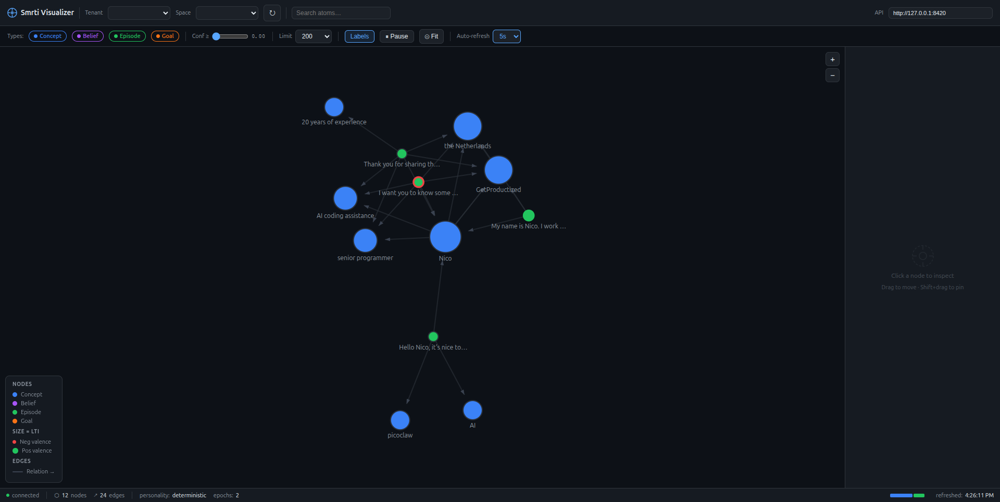
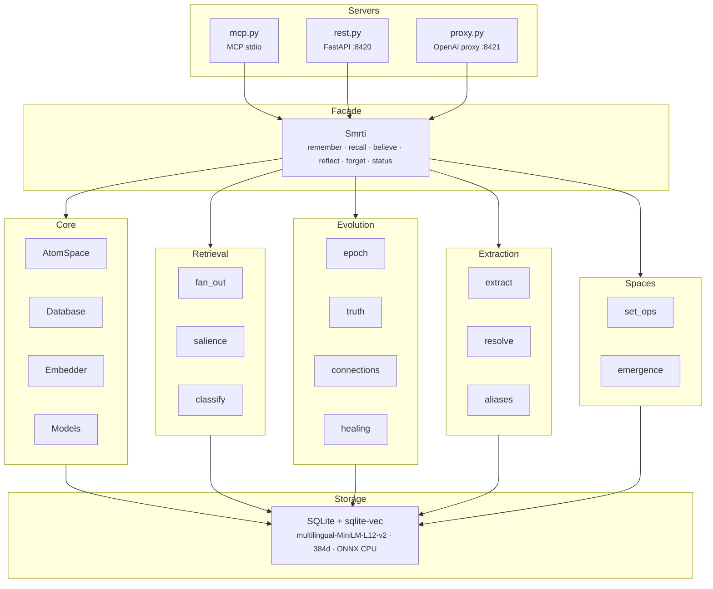

# smrti

[](https://pypi.org/project/smrti/)
[](https://pypi.org/project/smrti/)
[](LICENSE)
[](https://github.com/cyqlelabs/smrti/actions/workflows/ci.yml)
[](https://codecov.io/gh/cyqlelabs/smrti)

**Long-term memory for AI agents in a single SQLite file.** Your agent remembers what matters, forgets what doesn't, and never repeats a critical mistake — no vector database, no external services, no infrastructure.

Inspired by <a href="https://github.com/opencog/atomspace" target="_blank">AtomSpace</a>: memories are graph nodes with Bayesian truth values, emotional valence, and attention weights. Embedding similarity is only the entry point — a fast index to seed graph traversal. What gets recalled and why is governed by graph topology, probabilistic truth maintenance (PLN), attentional economics (STI/LTI), and emotional valence. Similarity is one signal among five, not the ranking.

- [Install](#install)
- [Quick Start](#quick-start)
- [Use with Claude / MCP clients](#mcp-server)
- [How It Works](#how-it-works)
- [Server Modes](#server-modes)
- [Configuration Reference](#configuration-reference)
- [Security & Monitoring](#security--monitoring)
- [Multi-Tenant / Space Model](#multi-tenant--space-model)
- [Personality System](#personality-system)
- [Architecture](#architecture)

## Why smrti

- **Zero infrastructure** — one SQLite file with [sqlite-vec](https://github.com/asg017/sqlite-vec) for KNN and ONNX embeddings on CPU. `pip install` and go.
- **Error-avoidance memory** — severe failures get a long-term-importance floor so they survive pruning, and recall dynamically boosts them: old-but-critical errors outrank recent trivia. Recalled memories are classified as `critical_warning`, `known_antipattern`, or `context`.
- **Automatic knowledge graph** — a hybrid GLiNER2 + LLM pipeline extracts entities and typed relations from everything you store, and resolves pronouns against the persisted graph — no manual schema.
- **Three integration paths** — MCP server for Claude and other LLM clients, REST API, or an OpenAI-compatible proxy that adds memory to any existing app by changing one base URL.
- **Multilingual** — 50+ languages end-to-end (multilingual embeddings, zero-shot NER, language-agnostic sentiment). No English-only heuristics anywhere.
- **Personality-driven** — six presets (16 tunable hyperparameters) shape what each agent notices, retains, and forgets. The same history produces different memories in different agents.

## Install

```bash
pip install smrti
```

### Container

Same package as `pip install smrti`, with the embedding model bundled so a fresh container recalls offline instead of stalling on a first-run download.

```bash
docker run -d -p 8420:8420 -v smrti-data:/data ghcr.io/cyqlelabs/smrti
```

That serves the REST API. Any other command replaces it, and every environment variable in the [configuration reference](#configuration-reference) works as usual:

```bash
docker run -d -p 8421:8421 -v smrti-data:/data \
  -e SMRTI_UPSTREAM_URL=http://host.docker.internal:11434/v1 \
  -e SMRTI_API_KEY=your-key \
  ghcr.io/cyqlelabs/smrti serve proxy --host 0.0.0.0 --port 8421
```

- **Tags** — `latest`, `0.9`, `0.9.0`, published on every `v*` tag.
- **Storage** — `SMRTI_DB` points at `/data/memory.db`; mount a volume or the graph dies with the container.
- **User** — runs as non-root `smrti`.

## Quick Start

### Python API

```python
from smrti import Smrti

mem = Smrti(db_path="~/.smrti/memory.db", personality="balanced")

# Store memories
mem.remember("Alice prefers TypeScript", probability=0.9, valence=0.3)
mem.remember("The deploy pipeline is broken", probability=0.95, valence=-0.7)

# Recall by semantic similarity + salience
results = mem.recall("programming languages")
for r in results:
    print(f"{r.atom.label} (salience={r.salience:.2f}, confidence={r.atom.truth.confidence:.2f})")

# Assert a belief with evidence
mem.believe("Python is the best language for ML", probability=0.85, evidence="Team survey results")

# Consolidate: decay, promote, prune, resolve contradictions
epoch = mem.reflect()
print(f"Updated {epoch.beliefs_updated} beliefs, pruned {epoch.atoms_pruned} atoms")

mem.close()
```

### CLI

```bash
smrti init --db ~/.smrti/memory.db --personality balanced   # create a database
smrti status                                                # inspect it

smrti serve mcp     # MCP stdio server (Claude, etc.)
smrti serve rest    # REST API on :8420
smrti serve viz     # REST API + memory visualizer in the browser
smrti serve proxy   # OpenAI-compatible proxy on :8421
smrti serve town    # city-builder simulation demo on :8430

smrti stop          # gracefully stop all servers started by `smrti serve`
smrti stop rest     # stop one mode (rest, viz, proxy, town); --port to narrow further
```

## How It Works

> [Full pipeline diagram →](docs/pipeline.md)

**`remember()`** — Embeds and stores text as a typed atom (concept, belief, episode, or goal) with a Bayesian truth value, attention weight, and valence score. Evidence is append-only; truth values update via PLN revision. Entities and relation edges are extracted automatically (the LLM is only called when GLiNER finds ≥2 entities, cutting LLM calls ~40–60%).

**`recall()`** — Embeds the query → KNN seeds → 1-hop graph expansion → salience re-ranking:

```
S = w_sim × similarity + w_sti × sti + w_conf × confidence + w_lti × lti + w_val × |valence| × intensity
```

When valence < −0.5, weight shifts dynamically from STI to valence so critical errors outrank recent trivia. Each result carries a severity classification (`critical_warning`, `known_antipattern`, or `context`).

**`reflect()`** — Runs automatically every 60 s (`SMRTI_REFLECT_INTERVAL`). Merges pending evidence via PLN, decays attention and confidence, propagates both to neighbors, heals orphaned episodes, promotes high-STI atoms to long-term importance, resolves contradictions, and prunes low-salience atoms. The personality profile governs every weight and threshold. Every atom also carries provenance (`user` vs `agent`): model-authored content decays faster and gets a lower long-term-importance floor, so what you told the agent outlives what it inferred.

## Server Modes

### MCP Server

Exposes 8 tools over stdio for direct LLM integration.

**Claude Code:**

```bash
claude mcp add smrti -- smrti serve mcp
```

**Claude Desktop** (or any MCP client) — add to your MCP config:

```json
{
  "mcpServers": {
    "smrti": {
      "command": "smrti",
      "args": ["serve", "mcp"],
      "env": { "SMRTI_DB": "~/.smrti/memory.db" }
    }
  }
}
```

| Tool          | Description                                                                                       |
| ------------- | ------------------------------------------------------------------------------------------------- |
| `remember`    | Store an episode, goal, or belief (use `type=belief` + `evidence` to assert a probabilistic fact) |
| `recall`      | Semantic search with salience scoring and severity classification                                 |
| `reflect`     | Run a consolidation epoch                                                                         |
| `forget`      | Lower confidence on a memory                                                                      |
| `status`      | Memory statistics and the tenant's spaces                                                         |
| `personality` | Get or set the personality preset                                                                 |
| `space_query` | Compare two spaces: `op=overlap` (Jaccard), `op=intersection`, `op=diff`                          |
| `space_merge` | Materialize a bridge space from the overlap between two spaces                                    |

### REST API

Full CRUD over HTTP on port 8420:

```bash
smrti serve rest --host 0.0.0.0 --port 8420
```

```bash
# Store a memory
curl -X POST http://localhost:8420/remember \
  -H "Content-Type: application/json" \
  -d '{"content": "Alice prefers TypeScript", "probability": 0.9}'

# Recall
curl -X POST http://localhost:8420/recall \
  -d '{"query": "programming languages", "top_k": 5}'

# Run consolidation
curl -X POST http://localhost:8420/reflect

# Get status
curl http://localhost:8420/status
```

### OpenAI-Compatible Proxy

The fastest way to add memory to an existing app: point your OpenAI client at the proxy and keep everything else the same. It intercepts each chat request, injects relevant memories into the system prompt, and stores the exchange afterward.

```bash
smrti serve proxy --host 0.0.0.0 --port 8421 --upstream https://api.openai.com
```

```python
from openai import OpenAI

client = OpenAI(
    base_url="http://localhost:8421/v1",
    api_key="sk-..."  # forwarded to upstream
)

response = client.chat.completions.create(
    model="gpt-4o",
    messages=[{"role": "user", "content": "What do you know about Alice?"}],
    extra_headers={
        "X-Smrti-Tenant-Id": "user_123",
        "X-Smrti-Write-Space": "work",
        "X-Smrti-Read-Spaces": "work,personal",
    }
)
```

On every request the proxy:

1. Recalls relevant memories from the read spaces, building the query from recent conversation context (not just the last message)
2. Injects them into the system prompt in two sections — behavioral constraints (`YOU MUST NOT` / `AVOID`) for `critical_warning` and `known_antipattern` memories, and background context (`Note:`) for the rest — each with a confidence qualifier
3. Stores the user message and assistant response as episodes (identical episodes are deduplicated per tenant/space)
4. Extracts entities and claims into concept nodes and typed relation edges

Works with any OpenAI-compatible upstream — including local llama.cpp, vLLM, or Ollama endpoints.

### Memory Visualizer

`smrti serve viz` opens a browser-based graph explorer to inspect atoms, relations, and attention weights, plus an **LLM Calls** debug tab showing every extraction request with full request/response, timing, and recalled memories.

[](docs/visualizer.png)

## Configuration Reference

All server modes read the same environment variables. Everything works with zero configuration; set these to customize.

**Core (all modes):**

| Variable                 | Default              | Purpose                                            |
| ------------------------ | -------------------- | -------------------------------------------------- |
| `SMRTI_DB`               | `~/.smrti/memory.db` | Database file path                                 |
| `SMRTI_PERSONALITY`      | `balanced`           | Personality preset                                 |
| `SMRTI_TENANT_ID`        | `default`            | Tenant partition (hard isolation)                  |
| `SMRTI_SPACE`            | `default`            | Write space                                        |
| `SMRTI_READ_SPACES`      | write space          | Comma-separated spaces to read from                |
| `SMRTI_REFLECT_INTERVAL` | `60`                 | Auto-consolidation interval in seconds (0 = off)   |
| `SMRTI_IGNORE_PATTERNS`  | —                    | Newline-separated regexes; matching content is dropped before storage (see below) |

**Security (REST / proxy / viz):**

| Variable             | Default | Purpose                                                                                  |
| -------------------- | ------- | ---------------------------------------------------------------------------------------- |
| `SMRTI_API_KEY`      | —       | When set, every request must send `Authorization: Bearer <key>` or `X-Api-Key: <key>`    |
| `SMRTI_CORS_ORIGINS` | —       | Comma-separated allowed origins for the proxy; CORS middleware is only added when set    |
| `SMRTI_VIZ_DBS`      | —       | Extra SQLite paths (`:`-separated) the visualizer's DB box may open; by default only the server's own database is browsable |

**Proxy:**

| Variable                      | Default                  | Purpose                                                  |
| ----------------------------- | ------------------------ | -------------------------------------------------------- |
| `SMRTI_UPSTREAM_URL`          | `https://api.openai.com` | Upstream OpenAI-compatible API                           |
| `SMRTI_RECALL_TOP_K`          | `5`                      | Memories to inject per request                           |
| `SMRTI_RECALL_MIN_CONFIDENCE` | `0.3`                    | Confidence floor for injected memories                   |
| `SMRTI_QUERY_MODE`            | `concat`                 | Recall query source: `concat` recent context or `last` message only |
| `SMRTI_QUERY_CONTEXT_MSGS`    | `5`                      | Recent messages included in the recall query             |
| `SMRTI_QUERY_MAX_CHARS`       | `500`                    | Max characters of the recall query                       |
| `SMRTI_INJECT_MAX_CHARS`      | `500`                    | Max characters per injected memory                       |

**Extraction (all modes):**

| Variable                 | Default                    | Purpose                                                          |
| ------------------------ | -------------------------- | ---------------------------------------------------------------- |
| `SMRTI_EXTRACT`          | `1`                        | Entity/claim extraction after every `remember` (0 = off)         |
| `SMRTI_EXTRACT_MODE`     | `hybrid`                   | `hybrid` (GLiNER + LLM), `llm` (LLM-only), `local` (no LLM)      |
| `SMRTI_EXTRACT_URL`      | upstream URL               | LLM endpoint for extraction calls                                |
| `SMRTI_EXTRACT_MODEL`    | request model              | Model for extraction calls                                       |
| `SMRTI_EXTRACT_THINKING` | `disabled`                 | Chain-of-thought for extraction: `disabled` is faster and avoids token-budget exhaustion on thinking models (Qwen3, DeepSeek-R1); also `auto`, `enabled` |
| `SMRTI_EXTRACT_TIMEOUT`  | `60`                       | Extraction request timeout in seconds                            |
| `SMRTI_NER_MODEL`        | `fastino/gliner2-multi-v1` | GLiNER2 model for local zero-shot NER                            |

### Ignoring Automated Messages

Agentic frameworks often produce periodic system messages (heartbeat checks, status pings, tool scaffolding) that should not pollute memory. Any `remember()` call matching `SMRTI_IGNORE_PATTERNS` is silently dropped before embedding or extraction:

```bash
export SMRTI_IGNORE_PATTERNS="^# Heartbeat Check
^HEARTBEAT_OK$"
```

Patterns are matched with `re.search` (anchors optional) and apply to all server modes.

## Security & Monitoring

**API key auth** — HTTP servers are open by default for local use. Set `SMRTI_API_KEY` to require a key on every REST, proxy, and visualizer request (`Authorization: Bearer <key>` or `X-Api-Key: <key>`). The CLI warns when you bind to a non-loopback host without a key set.

**Prometheus metrics** — REST and proxy expose `GET /metrics` in Prometheus text format, with zero extra dependencies. Gauges include `smrti_atoms_total`, `smrti_atoms_by_type`, `smrti_epoch_count`, and the active personality hyperparameters, all labeled by `tenant` and `space` — so you can alert per tenant (e.g. "atom count flatlined → `remember` is failing") and track personality drift from Grafana or any Prometheus-compatible system.

## Multi-Tenant / Space Model

**Tenants** are hard walls: atoms, embeddings, and attention weights never cross them. **Spaces** are permeable layers within a tenant: you write to one, read from many, and each has its own personality and consolidation cycle.

```python
researcher = Smrti(tenant_id="team", write_space="researcher",
                   read_spaces=["researcher", "shared"], personality="curious")
deployer   = Smrti(tenant_id="team", write_space="deployer",
                   read_spaces=["deployer", "shared"], personality="deterministic")
coordinator = Smrti(tenant_id="team", write_space="coordinator",
                    read_spaces=["coordinator", "shared", "researcher", "deployer"],
                    personality="analytical")
shared = Smrti(tenant_id="team", write_space="shared")
```

Each space consolidates independently. The researcher forgets fast; the deployer holds onto critical failures; the coordinator sees everything but filters through its own lens. Over time each agent develops a different understanding of the same shared history.

Things people build with this: agent teams with private working memory and shared project context, multi-agent simulations where each agent remembers the same event differently, and role-based perspectives for the same user across contexts.

Spaces also support set-theory operations — overlap, intersection, difference, union, symmetric difference — and can materialize **bridge spaces** from the overlap between two spaces (see the `space_query` and `space_merge` tools).

## Personality System

Six built-in presets control retrieval behavior, decay rates, and emotional dynamics:

| Preset          | Bias                                       | Use Case                                 |
| --------------- | ------------------------------------------ | ---------------------------------------- |
| `balanced`      | Equal weights across all signals           | General-purpose agents                   |
| `analytical`    | High confidence weight, low valence        | Logical reasoning, data-driven decisions |
| `curious`       | High STI weight, fast decay                | Exploration, novelty-seeking             |
| `empathetic`    | High valence weight, emotional propagation | Relationship-focused agents              |
| `maverick`      | Slow decay, high propagation               | Independent, contrarian reasoning        |
| `deterministic` | Fast learning, slow decay, laser focus     | Agentic workflows, code gen, deployments |

Each preset tunes 16 hyperparameters. To create a custom personality, start from a preset and override individual values via the `personality` DB table or the `/personality` API endpoint.

<details>
<summary><strong>Hyperparameter reference</strong> (16 parameters, defaults from the <code>balanced</code> preset)</summary>

**Salience weights** — control how retrieval ranks results (should sum to ~1.0):

| Parameter | Default | Effect |
|-----------|---------|--------|
| `w_similarity` | 0.35 | Weight of embedding cosine similarity |
| `w_sti` | 0.25 | Weight of short-term importance (recency/access) |
| `w_confidence` | 0.20 | Weight of truth value confidence |
| `w_lti` | 0.10 | Weight of long-term importance |
| `w_valence` | 0.10 | Weight of emotional intensity (dynamically boosted when valence < -0.5) |

**Belief dynamics** — govern how confidence evolves over time:

| Parameter | Default | Effect |
|-----------|---------|--------|
| `confidence_decay_rate` | 0.02 | Per-epoch confidence decay. Higher = memories fade faster |
| `confidence_update_lr` | 0.3 | Learning rate for PLN evidence merges. Higher = new evidence has more impact |
| `min_confidence_to_surface` | 0.1 | Floor below which atoms are excluded from recall results |

**Attention dynamics** — control what stays in focus:

| Parameter | Default | Effect |
|-----------|---------|--------|
| `sti_decay_rate` | 0.1 | Per-epoch STI decay. Higher = faster attention loss |
| `sti_boost_on_access` | 0.5 | STI added each time an atom is recalled. Higher = stronger recency bias |
| `sti_propagation_factor` | 0.15 | Fraction of STI boost propagated to linked atoms. Higher = broader activation |
| `lti_promotion_threshold` | 0.7 | Cumulative STI required to increment LTI. Higher = harder to become permanent |

**Emotional dynamics** — shape how valence influences behavior:

| Parameter | Default | Effect |
|-----------|---------|--------|
| `valence_weight` | 0.2 | Global scaling factor for emotional influence on salience |
| `valence_propagation` | 0.1 | Fraction of valence propagated to linked atoms during epochs |
| `mood_inertia` | 0.8 | Resistance to mood shifts (0 = reactive, 1 = stable) |

</details>

## Architecture



**Retrieval pipeline:** Embed query → KNN over tenant partition → filter to read spaces → 1-hop graph expansion → salience scoring → top-k

**Consolidation epoch** (runs automatically every `SMRTI_REFLECT_INTERVAL` seconds, or manually via `reflect()`):

1. Process pending evidence via Bayesian update
2. Decay STI and confidence
3. Propagate STI and valence to 1-hop neighbors
4. Heal orphaned episodes (link to most salient person)
5. Promote high-STI atoms to LTI
6. Resolve contradictions (weaken less confident belief)
7. Discover cross-domain connections (every 10th epoch)
8. Materialize cross-space bridge atoms (every 10th epoch)
9. Prune atoms below confidence/LTI floors

## Data Model

| Atom Type  | Purpose                  | Example                          |
| ---------- | ------------------------ | -------------------------------- |
| `concept`  | Reusable entities        | "Alice", "Python", "OpenAI"      |
| `belief`   | Probabilistic facts      | "Alice prefers TypeScript"       |
| `episode`  | Timestamped observations | "User asked about deployment"    |
| `goal`     | Desired states           | "Finish the migration by Friday" |
| `relation` | Edges between atoms      | Alice → works_at → Acme Corp     |

Each atom carries:

- **TruthValue** — `probability` [0,1] and `confidence` [0,1], merged via PLN revision
- **AttentionValue** — `sti` (short-term importance, decays fast) and `lti` (long-term, accumulates)
- **Valence** — emotional tone [-1,1] and intensity [0,1]

## smrti-town

A living demo: [smrti-town](src/smrti_town/README.md) is a city-builder where every citizen carries a persistent smrti memory graph. You place the Town Hall and choose a mayor; an LLM-generated council debates what to build, citizens immigrate, work, and petition — and every decision they make is driven by what they remember.

```bash
smrti serve town   # simulation + frontend on :8430
```

## Testing

```bash
pytest tests/ -v
```

## License

MIT
