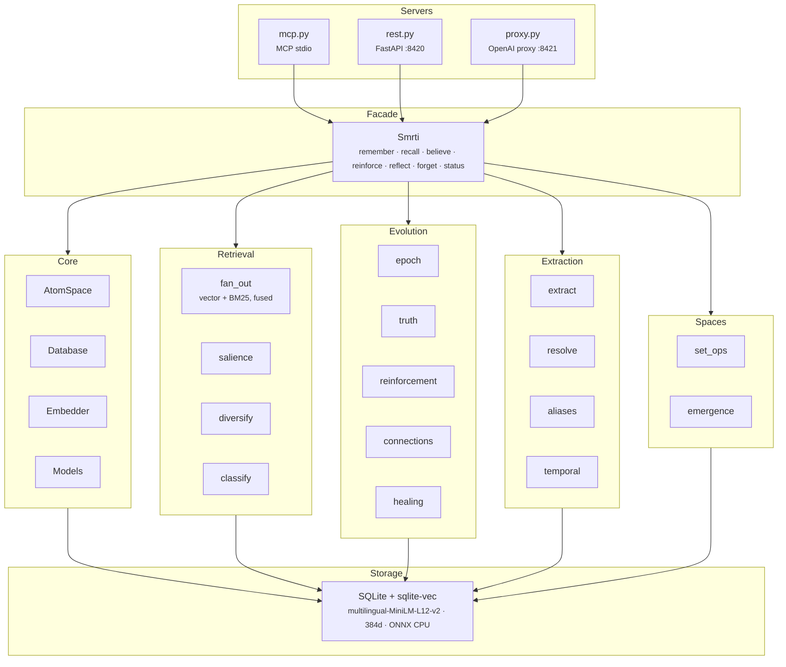

# smrti

[](https://pypi.org/project/smrti/)
[](https://pypi.org/project/smrti/)
[](LICENSE)
[](https://github.com/cyqlelabs/smrti/actions/workflows/ci.yml)
[](https://codecov.io/gh/cyqlelabs/smrti)

**Long-term memory for AI agents in a single SQLite file.** Your agent remembers what matters, forgets what doesn't, and never repeats a critical mistake — no vector database, no external services, no infrastructure.

Inspired by [AtomSpace](https://github.com/opencog/atomspace): memories are graph nodes with truth values, attention weights, and emotional valence. Retrieval fuses vector and lexical search, expands one hop through extracted relations, and ranks by relevance scaled by standing (attention, confidence, tone) under a personality that sets the weights, so nothing outranks a memory about the question because it is important elsewhere. Consolidation runs when the agent is used, not when the clock ticks.

- [Why smrti](#why-smrti)
- [Install](#install)
- [Quick Start](#quick-start)
- [How It Works](#how-it-works)
- [Server Modes](#server-modes) (MCP, REST, proxy, visualizer)
- [Configuration Reference](#configuration-reference)
- [Security & Monitoring](#security--monitoring)
- [Multi-Tenant / Space Model](#multi-tenant--space-model)
- [Personality System](#personality-system)
- [Architecture](#architecture)
- [Data Model](#data-model)
- [smrti-town](#smrti-town)
- [Benchmarks](#benchmarks)
- [Upgrading](#upgrading)

## Why smrti

- **Zero infrastructure** — one SQLite file with [sqlite-vec](https://github.com/asg017/sqlite-vec) for KNN, and ONNX embeddings and NER on CPU (no PyTorch). `pip install` and go.
- **Error-avoidance memory** — severe failures survive pruning and outrank recent trivia at recall; every result comes back classified as `critical_warning`, `known_antipattern`, or `context`.
- **Knowledge graph** — in the server modes, a GLiNER2 + LLM pipeline extracts entities and typed relations from what you store and resolves pronouns against the graph; no manual schema.
- **Three integration paths** — MCP server, REST API, or an OpenAI-compatible proxy that adds memory to an existing app by changing one base URL.
- **Multilingual** — 50+ languages end-to-end: multilingual embeddings, zero-shot NER, language-agnostic sentiment.
- **Personality-driven** — six presets (17 hyperparameters) shape what each agent notices, retains, and forgets.

## Install

```bash
pip install smrti
```

### Container

Same package as `pip install smrti`, with the embedding model bundled so a fresh container recalls offline instead of stalling on a first-run download.

```bash
docker run -d -p 8420:8420 -v smrti-data:/data ghcr.io/cyqlelabs/smrti
```

That serves the REST API. Any other command replaces it, and every environment variable in the [configuration reference](#configuration-reference) works as usual:

```bash
docker run -d -p 8421:8421 -v smrti-data:/data \
  -e SMRTI_UPSTREAM_URL=http://host.docker.internal:11434/v1 \
  -e SMRTI_API_KEY=your-key \
  ghcr.io/cyqlelabs/smrti serve proxy --host 0.0.0.0 --port 8421
```

- **Tags** — every `v*` release publishes `latest`, the exact version, and a rolling `MAJOR.MINOR`; pin whichever you want to track.
- **Storage** — `/data` holds the database and the NER weights that download on first extraction; mount a volume or both die with the container.
- **User** — runs as non-root `smrti`.

## Quick Start

### Python API

```python
from smrti import Smrti

mem = Smrti(db_path="~/.smrti/memory.db", personality="balanced")

# Store memories
mem.remember("Alice prefers TypeScript", probability=0.9, valence=0.3)
mem.remember("The deploy pipeline is broken", probability=0.95, valence=-0.7)

# Recall by relevance and salience
results = mem.recall("programming languages")
for r in results:
    print(f"{r.atom.label} (salience={r.salience:.2f}, confidence={r.atom.truth.confidence:.2f})")

# Report that the recalled memories were used
mem.reinforce([r.atom.id for r in results])

# Assert a belief with a reason, and read the reason back
atom_id = mem.believe("Python is the best language for ML", probability=0.85, evidence="Team survey results")
print(mem.evidence(atom_id)[0].text)

# Stop a memory from surfacing
mem.forget("deploy pipeline")

# Consolidate: revise evidence, decay, promote, prune
epoch = mem.reflect()
print(f"Updated {epoch.beliefs_updated} beliefs, pruned {epoch.atoms_pruned} atoms")
```

The constructor also takes `tenant_id`, `write_space`, `read_spaces`, `ignore_patterns`, and `temporal` (see [Multi-Tenant / Space Model](#multi-tenant--space-model)). The Python API stores, recalls, forgets, and consolidates; entity extraction and relative-date resolution run in the server modes (pass `temporal=True` for dates here). The embedding model downloads on first use, the NER weights on first extraction.

### CLI

```bash
smrti init --db ~/.smrti/memory.db --personality balanced   # create a database
smrti status                                                # inspect it

smrti serve mcp     # MCP stdio server (Claude, etc.)
smrti serve rest    # REST API on :8420
smrti serve viz     # REST API + memory visualizer in the browser
smrti serve proxy   # OpenAI-compatible proxy on :8421
smrti serve town    # city-builder simulation demo on :8430

smrti stop          # gracefully stop all servers started by `smrti serve`
smrti stop rest     # stop one mode (rest, viz, proxy, town); --port to narrow further
```

## How It Works

> [Full pipeline diagram →](docs/pipeline.md)

### `remember()`

Embeds and stores text as a typed atom (episode, concept, belief, or goal) with a truth value, attention weight, and valence.

- `valence` unset is estimated from the text. Set it yourself and the memory is a deliberate report, the only kind recall can raise to a behavioral constraint. `intensity` is how strongly the tone is felt; unset, it is `|valence|`.
- `type="belief"` is `believe()`: a belief starts at confidence 0.3 and earns more through evidence. Asserted at probability ≥ 0.95 it is permanent and exempt from decay. The `evidence` reason is kept on the evidence log; `evidence(atom_id)` lists it.
- In the server modes, relative dates are resolved against the write time ("the session is tomorrow" still names a day next week), and entities and relations are extracted into the graph. A claim that replaces an earlier one about the same subject (a new city, a new employer, a changed preference) is recorded as superseding it.

### `recall()`

Runs a vector KNN and a BM25 search over the read spaces, fuses them by Reciprocal Rank Fusion, expands one hop through the graph, and ranks by salience:

```
S = similarity × ( w_sim + w_sti × sti + w_conf × confidence + w_lti × lti + w_val × |valence| × intensity )
```

Similarity multiplies the standing terms, so a memory that is not about the question cannot outrank one that is; among memories that are, standing decides the order. On top of that:

- When valence < −0.5, weight shifts from STI to valence, so old critical errors outrank recent trivia. Valence terms read the tone a memory was written with, not the mood it has absorbed.
- An episode that restates the query scores nothing.
- `agent_source_trust` discounts an agent-authored memory's standing, never its similarity.
- Episodes repeating one already chosen from the same minutes share `max(2, top_k // 6)` slots; beliefs keep up to two.
- Results below the personality's `min_confidence_to_surface` are excluded unless you pass `min_confidence`; forgotten memories never return.

Each result carries a `severity`: `critical_warning` (a valence you stated, on anything but a bare concept), `known_antipattern` (a belief whose probability fell below 0.3, where a superseded preference or constraint lands), or `context`.

### `forget()`

Stops the memories matching a query from surfacing. They are excluded from every recall, no consolidation lifts them back, and the next epoch may prune them. Forgetting is final.

### `reinforce()`

Reports that recalled memories were used; a cheap test is that distinctive words from a memory appeared in the reply it informed. Use is weak evidence: confidence climbs a little, capped per epoch and discounted for agent-authored memories, and probability does not move.

### `reflect()`

One consolidation epoch: revise pending evidence, decay attention and confidence, propagate both to neighbors, heal orphaned episodes, promote high-STI atoms to long-term importance, resolve contradictions (a superseded claim loses), link similar high-LTI atoms (every tenth epoch), and prune what fell below the floors. The servers run one every `SMRTI_REFLECT_INTERVAL` seconds for each space used in that interval, so idle memory does not age. What you told the agent decays only to the surfacing floor and stays recallable unless you forget it; what it inferred keeps fading, faster for agent-authored atoms.

## Server Modes

### MCP Server

Exposes 8 tools over stdio for direct LLM integration.

**Claude Code:**

```bash
claude mcp add smrti -- smrti serve mcp
```

**Claude Desktop** (or any MCP client) — add to your MCP config:

```json
{
  "mcpServers": {
    "smrti": {
      "command": "smrti",
      "args": ["serve", "mcp"],
      "env": { "SMRTI_DB": "~/.smrti/memory.db" }
    }
  }
}
```

| Tool                  | Description                                                                                       |
| --------------------- | ------------------------------------------------------------------------------------------------- |
| `smrti_remember`      | Store an episode, goal, or belief (use `type=belief` + `evidence` to assert a probabilistic fact) |
| `smrti_recall`        | Semantic search with salience scoring and severity classification                                 |
| `smrti_reflect`       | Run a consolidation epoch                                                                         |
| `smrti_forget`        | Stop memories matching a query from surfacing; the next epoch may prune them                      |
| `smrti_status`        | Memory statistics and the tenant's spaces                                                         |
| `smrti_personality`   | Get or set the personality preset                                                                 |
| `smrti_space_query`   | Compare two spaces: `op=overlap` (Jaccard), `op=intersection`, `op=diff`                          |
| `smrti_space_merge`   | Materialize a bridge space from the overlap between two spaces                                    |

### REST API

Full CRUD over HTTP on port 8420:

```bash
smrti serve rest --host 0.0.0.0 --port 8420
```

```bash
# Store a memory
curl -X POST http://localhost:8420/remember \
  -H "Content-Type: application/json" \
  -d '{"content": "Alice prefers TypeScript", "probability": 0.9}'

# Recall
curl -X POST http://localhost:8420/recall \
  -d '{"query": "programming languages", "top_k": 5}'

# Report that recalled memories shaped the reply — being used builds confidence
curl -X POST localhost:8420/reinforce \
  -H 'Content-Type: application/json' \
  -d '{"atom_ids": ["4f2c…", "9ab1…"]}'

# Run consolidation
curl -X POST http://localhost:8420/reflect

# Get status
curl http://localhost:8420/status

# Compare two spaces (op = overlap | intersection | diff)
curl -X POST http://localhost:8420/space_query \
  -d '{"op": "overlap", "other_space": "personal"}'

# Grow a bridge space from what two spaces share
curl -X POST http://localhost:8420/space_merge \
  -d '{"other_space": "personal", "min_jaccard": 0.1}'
```

Every endpoint takes an optional `space` to route the call; `/space_query` and
`/space_merge` compare that space with `other_space` and refuse a self-compare.

### OpenAI-Compatible Proxy

The fastest way to add memory to an existing app: point your OpenAI client at the proxy and keep everything else the same. It intercepts each chat request, injects relevant memories into the system prompt, and stores the exchange afterward.

```bash
smrti serve proxy --host 0.0.0.0 --port 8421 --upstream https://api.openai.com
```

```python
from openai import OpenAI

client = OpenAI(
    base_url="http://localhost:8421/v1",
    api_key="sk-..."  # forwarded to upstream
)

response = client.chat.completions.create(
    model="gpt-4o",
    messages=[{"role": "user", "content": "What do you know about Alice?"}],
    extra_headers={
        "X-Smrti-Tenant-Id": "user_123",
        "X-Smrti-Write-Space": "work",
        "X-Smrti-Read-Spaces": "work,personal",
    }
)
```

On every request the proxy:

1. Recalls relevant memories from the read spaces, building the query from recent conversation context (not just the last message)
2. Injects them into the system prompt in two sections — behavioral constraints (`YOU MUST NOT` / `AVOID`) for `critical_warning` and `known_antipattern` memories, and background context (`Note:`) for the rest — each with a confidence qualifier
3. Stores the user message and assistant response as episodes (identical episodes are deduplicated per tenant/space)
4. Extracts entities and claims into concept nodes and typed relation edges

Works with any OpenAI-compatible upstream — including local llama.cpp, vLLM, or Ollama endpoints.

### Memory Visualizer

`smrti serve viz` opens a browser-based graph explorer to inspect atoms, relations, and attention weights, plus an **LLM Calls** debug tab showing every extraction request with full request/response, timing, and recalled memories.

[](docs/visualizer.png)

## Configuration Reference

All server modes read the same environment variables. Everything works with zero configuration; set these to customize.

**Core (all modes):**

| Variable                 | Default              | Purpose                                            |
| ------------------------ | -------------------- | -------------------------------------------------- |
| `SMRTI_DB`               | `~/.smrti/memory.db` | Database file path                                 |
| `SMRTI_PERSONALITY`      | `balanced`           | Personality preset                                 |
| `SMRTI_TENANT_ID`        | `default`            | Tenant partition (hard isolation)                  |
| `SMRTI_SPACE`            | `default`            | Write space                                        |
| `SMRTI_READ_SPACES`      | write space          | Comma-separated spaces to read from                |
| `SMRTI_REFLECT_INTERVAL` | `60`                 | Seconds between consolidation epochs (0 = off); only spaces used during the interval get one |
| `SMRTI_RUN_DIR`          | `~/.smrti/run`       | Where `smrti serve` writes PID files so `smrti stop` can find its servers |
| `SMRTI_IGNORE_PATTERNS`  | —                    | Newline-separated regexes; matching content is dropped before storage (see below) |

**Security (REST / proxy / viz):**

| Variable             | Default | Purpose                                                                                  |
| -------------------- | ------- | ---------------------------------------------------------------------------------------- |
| `SMRTI_API_KEY`      | —       | When set, every request must send `Authorization: Bearer <key>` or `X-Api-Key: <key>`    |
| `SMRTI_CORS_ORIGINS` | —       | Comma-separated allowed origins for the proxy; CORS middleware is only added when set    |
| `SMRTI_VIZ_DBS`      | —       | `:`-separated extra SQLite paths the visualizer may open (default: the server's own DB only) |

**Proxy:**

| Variable                      | Default                  | Purpose                                                  |
| ----------------------------- | ------------------------ | -------------------------------------------------------- |
| `SMRTI_UPSTREAM_URL`          | `https://api.openai.com` | Upstream OpenAI-compatible API                           |
| `SMRTI_RECALL_TOP_K`          | `5`                      | Memories to inject per request                           |
| `SMRTI_RECALL_MIN_CONFIDENCE` | personality floor        | Confidence floor for injected memories                   |
| `SMRTI_QUERY_MODE`            | `concat`                 | Recall query source: `concat` recent context or `last` message only |
| `SMRTI_QUERY_CONTEXT_MSGS`    | `5`                      | Recent messages included in the recall query             |
| `SMRTI_QUERY_MAX_CHARS`       | `500`                    | Max characters of the recall query                       |
| `SMRTI_INJECT_MAX_CHARS`      | `500`                    | Max characters per injected memory                       |

**Extraction (all modes):**

To get the knowledge graph from `serve rest` or `serve mcp`, point `SMRTI_EXTRACT_URL` (and `SMRTI_EXTRACT_MODEL`) at an OpenAI-compatible endpoint; the proxy uses its upstream. Unset, extraction runs local NER only.

| Variable                 | Default                    | Purpose                                                          |
| ------------------------ | -------------------------- | ---------------------------------------------------------------- |
| `SMRTI_EXTRACT`          | `1`                        | Entity/claim extraction after every `remember` (0 = off)         |
| `SMRTI_EXTRACT_MODE`     | `hybrid`                   | `hybrid` (GLiNER + LLM), `llm` (LLM-only), `local` (no LLM)      |
| `SMRTI_EXTRACT_URL`      | proxy upstream, else unset | LLM endpoint for extraction calls; unset with no upstream = `local` mode |
| `SMRTI_EXTRACT_MODEL`    | request model              | Model for extraction calls                                       |
| `SMRTI_EXTRACT_THINKING` | `disabled`                 | `disabled` / `auto` / `enabled`; `disabled` is faster and avoids token-budget exhaustion on thinking models |
| `SMRTI_EXTRACT_TIMEOUT`  | `60`                       | Extraction request timeout in seconds                            |
| `SMRTI_NER_MODEL`        | `lmo3/gliner2-multi-v1-onnx` | GLiNER2 ONNX model for local zero-shot NER                     |
| `SMRTI_TEMPORAL`         | `1`                        | Resolve relative dates against the write time (0 = store text verbatim); one NER pass per write |

### Ignoring Automated Messages

Agentic frameworks often produce periodic system messages (heartbeat checks, status pings, tool scaffolding) that should not pollute memory. Any `remember()` call matching `SMRTI_IGNORE_PATTERNS` is silently dropped before embedding or extraction:

```bash
export SMRTI_IGNORE_PATTERNS="^# Heartbeat Check
^HEARTBEAT_OK$"
```

Patterns are matched with `re.search` (anchors optional) and apply to all server modes.

## Security & Monitoring

**API key auth** — HTTP servers are open by default for local use. Set `SMRTI_API_KEY` to require a key on every REST, proxy, and visualizer request (`Authorization: Bearer <key>` or `X-Api-Key: <key>`). The CLI warns when you bind to a non-loopback host without a key set.

**Prometheus metrics** — REST and proxy expose `GET /metrics` in Prometheus text format, with zero extra dependencies. Gauges include `smrti_atoms_total`, `smrti_atoms_by_type`, `smrti_epoch_count`, and the active personality hyperparameters, all labeled by `tenant` and `space`.

## Multi-Tenant / Space Model

**Tenants** are hard walls: atoms, embeddings, and attention weights never cross them. **Spaces** are permeable layers within a tenant: you write to one, read from many, and each has its own personality and consolidation cycle.

```python
researcher = Smrti(tenant_id="team", write_space="researcher",
                   read_spaces=["researcher", "shared"], personality="curious")
deployer   = Smrti(tenant_id="team", write_space="deployer",
                   read_spaces=["deployer", "shared"], personality="deterministic")
coordinator = Smrti(tenant_id="team", write_space="coordinator",
                    read_spaces=["coordinator", "shared", "researcher", "deployer"],
                    personality="analytical")
shared = Smrti(tenant_id="team", write_space="shared")
```

Each space consolidates independently: the researcher forgets fast, the deployer holds onto critical failures, and the coordinator reads everything through its own personality. This suits agent teams with private working memory and shared context, multi-agent simulations, and per-role views of one user.

Spaces also support set operations (overlap, intersection, difference, union, symmetric difference) and can materialize a **bridge space** from what two spaces share, via the `space_query` and `space_merge` MCP tools or the `POST /space_query` and `POST /space_merge` REST endpoints. Bridges are built only on request, never by the consolidation epoch.

## Personality System

Six built-in presets control retrieval behavior, decay rates, and emotional dynamics:

| Preset          | Bias                                       | Use Case                                 |
| --------------- | ------------------------------------------ | ---------------------------------------- |
| `balanced`      | Equal weights across all signals           | General-purpose agents                   |
| `analytical`    | High confidence weight, low valence        | Logical reasoning, data-driven decisions |
| `curious`       | High STI weight, fast decay                | Exploration, novelty-seeking             |
| `empathetic`    | High valence weight, emotional propagation | Relationship-focused agents              |
| `maverick`      | Slow decay, high propagation               | Independent, contrarian reasoning        |
| `deterministic` | Fast learning, slow decay, laser focus     | Agentic workflows, code gen, deployments |

Each preset tunes 17 hyperparameters. To create a custom personality, start from a preset and override individual values via the `personality` DB table or the `/personality` API endpoint.

<details>
<summary><strong>Hyperparameter reference</strong> (17 parameters, defaults from the <code>balanced</code> preset)</summary>

**Salience weights** — control how retrieval ranks results (should sum to ~1.0):

| Parameter | Default | Effect |
|-----------|---------|--------|
| `w_similarity` | 0.35 | Weight of embedding cosine similarity |
| `w_sti` | 0.25 | Weight of short-term importance (recency/access) |
| `w_confidence` | 0.20 | Weight of truth value confidence |
| `w_lti` | 0.10 | Weight of long-term importance |
| `w_valence` | 0.10 | Weight of emotional intensity (dynamically boosted when valence < -0.5) |

**Belief dynamics** — govern how confidence evolves over time:

| Parameter | Default | Effect |
|-----------|---------|--------|
| `confidence_decay_rate` | 0.02 | Per-epoch confidence decay. Higher = memories fade faster |
| `confidence_update_lr` | 0.3 | How far one observation moves a belief. Higher = new evidence counts for more |
| `min_confidence_to_surface` | 0.1 | Recall floor when the caller passes none; user testimony stops decaying here |

**Attention dynamics** — control what stays in focus:

| Parameter | Default | Effect |
|-----------|---------|--------|
| `sti_decay_rate` | 0.1 | Per-epoch STI decay. Higher = faster attention loss |
| `sti_boost_on_access` | 0.5 | STI added each time an atom is recalled. Higher = stronger recency bias |
| `sti_propagation_factor` | 0.15 | Fraction of STI boost propagated to linked atoms. Higher = broader activation |
| `lti_promotion_threshold` | 0.7 | STI above which an atom earns long-term importance. Higher = harder to earn |
| `lti_decay_rate` | 0.01 | Per-epoch LTI decay. Higher = long-term importance erodes faster |

**Provenance** — weighs what the agent wrote against what the user said:

| Parameter | Default | Effect |
|-----------|---------|--------|
| `agent_source_trust` | 0.5 | Standing of agent-authored memories relative to user-stated ones. Lower = model output fades faster while what the user said persists |

**Emotional dynamics** — shape how valence influences behavior:

| Parameter | Default | Effect |
|-----------|---------|--------|
| `valence_weight` | 0.2 | Strength of the weight shift from STI to valence for severely negative memories |
| `valence_propagation` | 0.1 | Fraction of valence spread to linked atoms each epoch. Moves the mood a recall result reports, not the tone ranking and severity judge on |
| `mood_inertia` | 0.8 | Resistance to mood shifts (0 = reactive, 1 = stable) |

</details>

## Architecture



**Retrieval:** embed the query → vector + BM25 search, fused → 1-hop graph expansion → salience ranking → diversity cap → top-k. **Consolidation:** the epoch steps under [`reflect()`](#reflect).

## Data Model

| Atom Type  | Purpose                  | Example                          |
| ---------- | ------------------------ | -------------------------------- |
| `concept`  | Reusable entities        | "Alice", "Python", "OpenAI"      |
| `belief`   | Probabilistic facts      | "Alice prefers TypeScript"       |
| `episode`  | Timestamped observations | "User asked about deployment"    |
| `goal`     | Desired states           | "Finish the migration by Friday" |
| `relation` | Edges between atoms      | Alice → works_at → Acme Corp     |

Each atom carries:

- **TruthValue** — `probability` [0,1] and `confidence` [0,1]. Confidence grows with evidence: every stated reason, re-mention, report of use, or supersession revises it (PLN revision). For episodes and concepts, which hold no proposition, it is retention strength rather than truth.
- **AttentionValue** — `sti` (short-term importance, decays fast) and `lti` (long-term, accumulates).
- **Valence** — emotional tone [-1,1] and intensity [0,1]. Ranking and severity read the tone a memory was written with; the `valence` a recall result reports is its current mood, which drifts toward its neighbors during consolidation.
- **Evidence** — an append-only log of observations: the probability observed, its weight, who reported it, and what was observed (`text`).

## smrti-town

A living demo: [smrti-town](src/smrti_town/README.md) is a city-builder where every citizen carries a persistent smrti memory graph. You place the Town Hall and choose a mayor; an LLM-generated council debates what to build, citizens immigrate, work, and petition — and every decision they make is driven by what they remember.

```bash
smrti serve town   # simulation + frontend on :8430
```

## Testing

```bash
pytest tests/ -v
```

## Benchmarks

Two harnesses in `bench/` ingest a published dataset as episodes and answer its questions through `recall`. Retrieval and answering are scored separately, so a strong answering model cannot hide a retrieval regression.

Config (2026-08-26): extraction off · no consolidation epochs · `top_k=50` · `deterministic` preset · gemini-3.7-flash answering and judging. This measures retrieval alone, and it predates the current ranking formula; re-run `make bench` before reading the numbers against the current engine.

| Benchmark | Scope | Retrieval | Answers | Notes |
| --------- | ----- | --------- | ------- | ----- |
| [LongMemEval-S](https://github.com/xiaowu0162/LongMemEval) | 40 questions, one per ability in turn | **0.975** hit · 0.912 evidence recall | **0.900** | 5 of 6 abilities retrieve without a miss |
| [HaluMem](https://huggingface.co/datasets/IAAR-Shanghai/HaluMem) | 3 personas, 180 questions | — | **0.517** correct | hallucination 0.394 · omission 0.089 |

```bash
make datasets        # fetch both into data/ (265MB + 32MB, once)
make bench           # fails if the retrieval hit rate drops
make bench-halumem   # fails if the hallucination rate rises

# add --extract-url/--extract-model to either to build the entity graph
# add --epochs N to consolidate each history N times before querying it
# add --top-k 5 to measure at the proxy's injection budget (10 for the MCP tool)
```

Each benchmark locks its config beside a recorded baseline and refuses to compare across configs; `--epochs` and `--top-k` join the fingerprint when set. Neither is a CI gate: both need the datasets, the embedding model, and a judge key.

**Where it is strong.** LongMemEval retrieves the annotated evidence for five of six abilities without a miss; temporal reasoning and assistant's-own-words questions are answered perfectly. On HaluMem's *memory boundary* questions (things the user never said), smrti answers correctly 97% of the time and invents something 2.9% of the time.

**Where it is weak.** HaluMem's synthesis categories hallucinate heavily: dynamic update 71%, multi-hop inference 63%, generalization 62%. smrti rarely declines to answer (8.9% omission, where published systems omit 17–35%), so an unknown often comes out as an assertion.

**Unmeasured.** The entity graph (`--extract-url`, about 1.25 s and one LLM call per turn) and consolidation (`--epochs`). HaluMem's memory-extraction and memory-update tasks are not implemented.

These numbers are not directly comparable to published results: the subsets are small (40 to 180 questions, so one question moves a category by several points), a single judge grades them where published protocols average three, and the answering model differs. LongMemEval leaderboard figures for reference: MemOS 77.8, Memobase 72.4, Mem0 66.4, Zep 63.8.

## Upgrading

An existing database is upgraded the first time a newer version opens it, with a `.pre-migration.bak` snapshot written beside it first; restore that file to downgrade. Migrations and data repairs are idempotent. The repairs rebuild the tone of entities extracted by earlier versions, drop the hub edges the old healing step drew, and let the pruner remove memories forgotten before this version. Bridge spaces an older epoch created on its own (`a_x_b`) are left in place; remove one with `DELETE /spaces/current?space=a_x_b`.

## License

MIT
