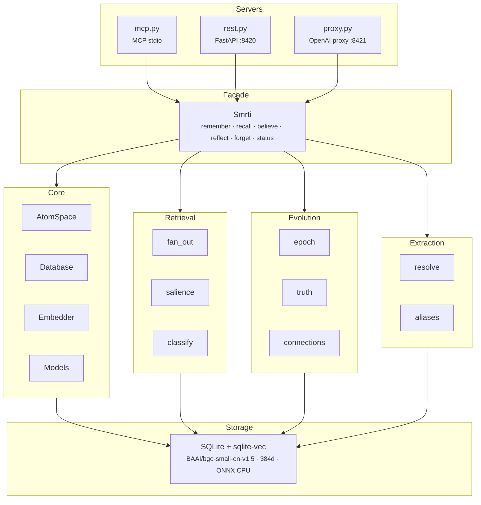

# smrti

[AtomSpace](https://wiki.opencog.org/w/AtomSpace)-inspired memory engine for AI agents. Stores beliefs as graph nodes with Bayesian truth values, emotional valence, and attention weights in a single SQLite file with vector indexing. No extra infra to maintain. Just Plug & Play.

## How It Works

When an agent calls `remember()`, Smrti embeds the text, resolves any entities it mentions (via a 4-tier cascade: exact → alias → fuzzy → embedding), and stores the result as a typed graph node (concept, belief, episode, or goal) carrying a Bayesian truth value, an attention weight, and an emotional valence score. Every observation is appended to an immutable evidence log — truth values are never mutated directly.

On `recall()`, the query is embedded and matched against the tenant-partitioned vector index (sqlite-vec KNN). Results are expanded one hop through the graph, then ranked by a salience formula that blends semantic similarity, short/long-term attention, confidence, and emotional intensity. When a memory has strong negative valence (e.g. a past outage), salience weights shift dynamically so critical errors outrank recent trivia. Each result is classified as `critical_warning`, `known_antipattern`, or `context`.

Consolidation happens automatically in all server modes (MCP, REST, proxy) on a configurable timer (default 60s, set `SMRTI_REFLECT_INTERVAL`). Each cycle merges pending evidence via PLN Bayesian revision, decays attention, promotes high-importance nodes to long-term memory, resolves contradictions by weakening the less confident belief, and prunes low-salience atoms. You can also trigger it manually via `reflect()`. A personality profile (16 tunable hyperparameters) governs every weight and threshold in this pipeline.

## Features

- **Graph-structured memory** — Concepts, beliefs, episodes, and goals as typed atoms with relation edges
- **Bayesian truth maintenance** — Probabilistic Logic Networks (PLN) for merging independent observations
- **Personality-driven retrieval** — 6 presets with 16 tunable hyperparameters that shape what gets surfaced
- **Multi-tenant isolation** — Tenant/space overlay model with cross-space reads and single-space writes
- **Three server modes** — MCP (stdio), REST API, and OpenAI-compatible proxy
- **Entity resolution** — 4-tier cascade: exact match, alias lookup, fuzzy (RapidFuzz), embedding similarity
- **Zero external services** — Single SQLite file with sqlite-vec for KNN search, ONNX embeddings on CPU

## Install

```bash
pip install -e .
```

## Quick Start

### Python API

```python
from smrti import Smrti

mem = Smrti(db_path="~/.smrti/memory.db", personality="balanced")

# Store memories
mem.remember("Alice prefers TypeScript", probability=0.9, valence=0.3)
mem.remember("The deploy pipeline is broken", probability=0.95, valence=-0.7)

# Recall by semantic similarity + salience
results = mem.recall("programming languages")
for r in results:
    print(f"{r.atom.label} (salience={r.salience:.2f}, confidence={r.atom.truth.confidence:.2f})")

# Assert a belief with evidence
mem.believe("Python is the best language for ML", probability=0.85, evidence="Team survey results")

# Consolidate: decay, promote, prune, resolve contradictions
epoch = mem.reflect()
print(f"Updated {epoch.beliefs_updated} beliefs, pruned {epoch.atoms_pruned} atoms")

mem.close()
```

### CLI

```bash
# Initialize a database
smrti init --db ~/.smrti/memory.db --personality balanced

# Check status
smrti status

# Start servers
smrti serve mcp           # MCP stdio server (for Claude, etc.)
smrti serve rest           # FastAPI on :8420
smrti serve proxy          # OpenAI-compatible proxy on :8421
```

## Server Modes

### MCP Server

Exposes 6 tools over stdio for direct LLM integration (Claude, etc.):

| Tool       | Description                           |
| ---------- | ------------------------------------- |
| `remember` | Store an observation or episode       |
| `recall`   | Semantic search with salience scoring |
| `believe`  | Assert a belief with truth value      |
| `reflect`  | Run a consolidation epoch             |
| `forget`   | Lower confidence on a memory          |
| `status`   | Get memory statistics                 |

```bash
smrti serve mcp
```

Configure via environment variables:

```bash
export SMRTI_DB=~/.smrti/memory.db
export SMRTI_PERSONALITY=balanced
export SMRTI_TENANT_ID=default
export SMRTI_SPACE=default
export SMRTI_READ_SPACES=default,shared   # comma-separated
export SMRTI_REFLECT_INTERVAL=60          # auto-consolidation interval in seconds (0 to disable)
```

### REST API

Full CRUD over HTTP on port 8420:

```bash
smrti serve rest --host 0.0.0.0 --port 8420
```

```bash
# Store a memory
curl -X POST http://localhost:8420/remember \
  -H "Content-Type: application/json" \
  -d '{"content": "Alice prefers TypeScript", "probability": 0.9}'

# Recall
curl -X POST http://localhost:8420/recall \
  -d '{"query": "programming languages", "top_k": 5}'

# Run consolidation
curl -X POST http://localhost:8420/reflect

# Get status
curl http://localhost:8420/status
```

### OpenAI-Compatible Proxy

Drop-in replacement for `https://api.openai.com/v1/chat/completions`. Intercepts requests, injects relevant memories into the system prompt, and stores the exchange afterward.

```bash
smrti serve proxy --host 0.0.0.0 --port 8421 --upstream https://api.openai.com
```

Use it from any OpenAI-compatible client:

```python
from openai import OpenAI

client = OpenAI(
    base_url="http://localhost:8421/v1",
    api_key="sk-..."  # forwarded to upstream
)

response = client.chat.completions.create(
    model="gpt-4o",
    messages=[{"role": "user", "content": "What do you know about Alice?"}],
    extra_headers={
        "X-Smrti-Tenant-Id": "user_123",
        "X-Smrti-Write-Space": "work",
        "X-Smrti-Read-Spaces": "work,personal",
    }
)
```

The proxy automatically:

1. Recalls relevant memories from the specified read spaces (using recent conversation context, not just the last message)
2. Classifies each memory by severity (`critical_warning`, `known_antipattern`, `context`) and injects them as structured XML tags into the system prompt
3. Stores user messages and the assistant response as episodes

Configure with:

```bash
export SMRTI_UPSTREAM_URL=https://api.openai.com  # or any OpenAI-compatible API
export SMRTI_RECALL_TOP_K=5
export SMRTI_RECALL_MIN_CONFIDENCE=0.3
export SMRTI_QUERY_MODE=concat        # "concat" (default) or "last" for last-message-only
export SMRTI_QUERY_CONTEXT_MSGS=5     # number of recent messages to include in query
export SMRTI_QUERY_MAX_CHARS=500      # max characters for the recall query
export SMRTI_REFLECT_INTERVAL=60      # auto-consolidation interval in seconds (0 to disable)
```

## Multi-Tenant / Space Model

Smrti uses a two-level isolation model:

- **Tenant** — Hard boundary. Different tenants never share atoms. Maps to a user or organization.
- **Space** — Soft boundary within a tenant. Memories are written to one space but can be read from multiple.

```python
# Read from multiple spaces, write to one
mem = Smrti(
    tenant_id="user_123",
    write_space="work",
    read_spaces=["work", "personal", "shared"]
)

# Each space can have its own personality
mem.set_personality("analytical")
```

## Personality System

Six built-in presets control retrieval behavior, decay rates, and emotional dynamics:

| Preset          | Bias                                       | Use Case                                 |
| --------------- | ------------------------------------------ | ---------------------------------------- |
| `balanced`      | Equal weights across all signals           | General-purpose agents                   |
| `analytical`    | High confidence weight, low valence        | Logical reasoning, data-driven decisions |
| `curious`       | High STI weight, fast decay                | Exploration, novelty-seeking             |
| `empathetic`    | High valence weight, emotional propagation | Relationship-focused agents              |
| `maverick`      | Slow decay, high propagation               | Independent, contrarian reasoning        |
| `deterministic` | Fast learning, slow decay, laser focus     | Agentic workflows, code gen, deployments |

Each preset tunes 16 hyperparameters affecting:

- **Salience weights** — How similarity, attention, confidence, and valence contribute to retrieval ranking
- **Belief dynamics** — Confidence decay rate, learning rate, minimum surfacing threshold
- **Attention dynamics** — STI decay/boost, LTI promotion threshold
- **Emotional dynamics** — Valence weight, propagation, mood inertia

## Architecture



**Retrieval pipeline:** Embed query → KNN over tenant partition → filter to read spaces → 1-hop graph expansion → salience scoring → top-k

**Salience formula:**

```
S = w_sim × similarity + w_sti × sti + w_conf × confidence + w_lti × lti + w_val × |valence| × intensity

When valence < -0.5, weight shifts dynamically from w_sti to w_val so critical errors outrank recent trivia.
```

**Consolidation epoch** (runs automatically every `SMRTI_REFLECT_INTERVAL` seconds, or manually via `reflect()`):

1. Process pending evidence via Bayesian update
2. Decay STI and confidence
3. Promote high-STI atoms to LTI
4. Resolve contradictions (weaken less confident belief)
5. Discover cross-domain connections (every 10th epoch)
6. Prune atoms below confidence/LTI floors

## Data Model

| Atom Type  | Purpose                  | Example                          |
| ---------- | ------------------------ | -------------------------------- |
| `concept`  | Reusable entities        | "Alice", "Python", "OpenAI"      |
| `belief`   | Probabilistic facts      | "Alice prefers TypeScript"       |
| `episode`  | Timestamped observations | "User asked about deployment"    |
| `goal`     | Desired states           | "Finish the migration by Friday" |
| `relation` | Edges between atoms      | Alice → works_at → Acme Corp     |

Each atom carries:

- **TruthValue** — `probability` [0,1] and `confidence` [0,1], merged via PLN revision
- **AttentionValue** — `sti` (short-term importance, decays fast) and `lti` (long-term, accumulates)
- **Valence** — emotional tone [-1,1] and intensity [0,1]

## Testing

```bash
pytest tests/ -v
```

## License

MIT
