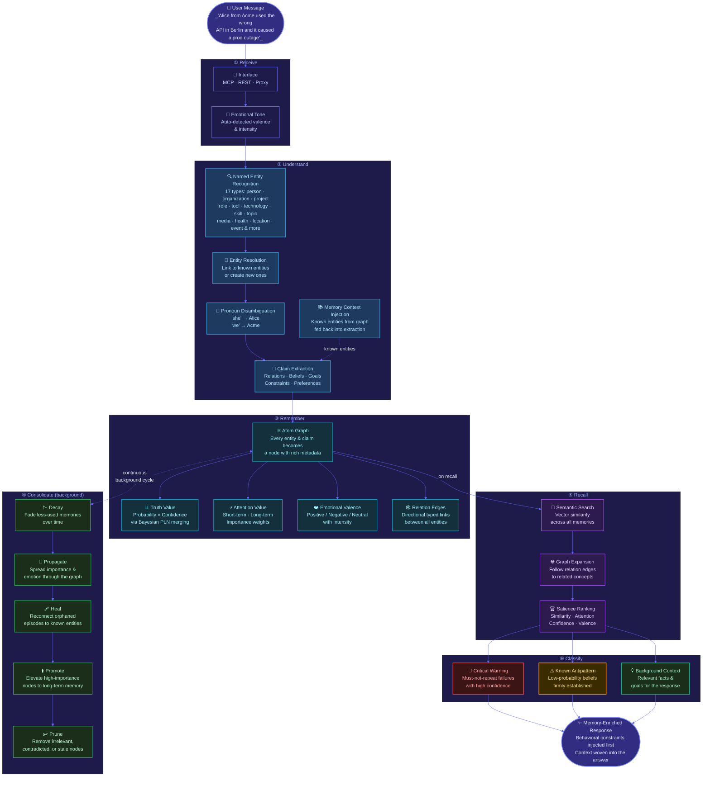

```mermaid
%%{init: {
  "theme": "base",
  "themeVariables": {
    "primaryColor": "#1a1a2e",
    "primaryTextColor": "#e2e8f0",
    "primaryBorderColor": "#4f46e5",
    "lineColor": "#6366f1",
    "secondaryColor": "#0f172a",
    "tertiaryColor": "#1e1b4b",
    "background": "#0f0f1a",
    "mainBkg": "#1a1a2e",
    "nodeBorder": "#4f46e5",
    "clusterBkg": "#1e1b4b",
    "titleColor": "#a5b4fc",
    "edgeLabelBackground": "#1e1b4b",
    "fontFamily": "Inter, ui-sans-serif, system-ui"
  }
}}%%

flowchart TD
    USER(["💬 User Message\n_'Alice from Acme used the wrong\nAPI in Berlin and it caused a prod outage'_"])

    subgraph RECEIVE ["  ① Receive  "]
        GATE["🔌 Interface\nMCP · REST · Proxy"]
        SENTIMENT["💜 Emotional Tone\nAuto-detected valence\n& intensity"]
    end

    subgraph UNDERSTAND ["  ② Understand  "]
        NER["🔍 Named Entity Recognition\n17 types: person · organization · project\nrole · tool · technology · skill · topic\nmedia · health · location · event & more"]
        RESOLVE["🔗 Entity Resolution\nLink to known entities\nor create new ones"]
        PRONOUNS["👥 Pronoun Disambiguation\n'she' → Alice\n'we' → Acme"]
        CLAIMS["🧠 Claim Extraction\nRelations · Beliefs · Goals\nConstraints · Preferences"]
        CONTEXT["📚 Memory Context Injection\nKnown entities from graph\nfed back into extraction"]
    end

    subgraph STORE ["  ③ Remember  "]
        ATOMS["⚛️ Atom Graph\nEvery entity & claim becomes\na node with rich metadata"]
        TV["📊 Truth Value\nProbability × Confidence\nvia Bayesian PLN merging"]
        AV["⚡ Attention Value\nShort-term · Long-term\nImportance weights"]
        VAL["❤️ Emotional Valence\nPositive / Negative / Neutral\nwith Intensity"]
        EDGES["🕸️ Relation Edges\nDirectional typed links\nbetween all entities"]
    end

    subgraph EVOLVE ["  ④ Consolidate (background)  "]
        DECAY["📉 Decay\nFade less-used memories\nover time"]
        PROPAGATE["🌊 Propagate\nSpread importance &\nemotion through the graph"]
        HEAL["🩹 Heal\nReconnect orphaned\nepisodes to known entities"]
        PROMOTE["⬆️ Promote\nElevate high-importance\nnodes to long-term memory"]
        PRUNE["✂️ Prune\nRemove irrelevant,\ncontradicted, or stale nodes"]
    end

    subgraph RETRIEVE ["  ⑤ Recall  "]
        KNN["🔎 Semantic Search\nVector similarity\nacross all memories"]
        EXPAND["🌐 Graph Expansion\nFollow relation edges\nto related concepts"]
        SALIENCE["🏆 Salience Ranking\nSimilarity · Attention\nConfidence · Valence"]
    end

    subgraph CLASSIFY ["  ⑥ Classify  "]
        CRITICAL["🚨 Critical Warning\nMust-not-repeat failures\nwith high confidence"]
        ANTIPATTERN["⚠️ Known Antipattern\nLow-probability beliefs\nfirmly established"]
        CONTEXT_OUT["💡 Background Context\nRelevant facts &\ngoals for the response"]
    end

    RESPOND(["✨ Memory-Enriched Response\nBehavioral constraints injected first\nContext woven into the answer"])

    USER --> GATE
    GATE --> SENTIMENT
    SENTIMENT --> NER
    NER --> RESOLVE
    RESOLVE --> PRONOUNS
    PRONOUNS --> CLAIMS
    CONTEXT -.->|"known entities"| CLAIMS
    CLAIMS --> ATOMS
    ATOMS --> TV & AV & VAL & EDGES

    ATOMS <-.->|"continuous\nbackground cycle"| DECAY
    DECAY --> PROPAGATE --> HEAL --> PROMOTE --> PRUNE

    ATOMS -->|"on recall"| KNN
    KNN --> EXPAND --> SALIENCE
    SALIENCE --> CRITICAL & ANTIPATTERN & CONTEXT_OUT
    CRITICAL & ANTIPATTERN & CONTEXT_OUT --> RESPOND

    classDef userNode fill:#312e81,stroke:#818cf8,stroke-width:2px,color:#e0e7ff,rx:20
    classDef receiveNode fill:#1e1b4b,stroke:#6366f1,stroke-width:1.5px,color:#c7d2fe
    classDef understandNode fill:#1e3a5f,stroke:#38bdf8,stroke-width:1.5px,color:#bae6fd
    classDef storeNode fill:#14303d,stroke:#06b6d4,stroke-width:1.5px,color:#a5f3fc
    classDef evolveNode fill:#1a2e1a,stroke:#22c55e,stroke-width:1.5px,color:#bbf7d0
    classDef retrieveNode fill:#2d1b4e,stroke:#a855f7,stroke-width:1.5px,color:#e9d5ff
    classDef criticalNode fill:#3b1515,stroke:#ef4444,stroke-width:2px,color:#fca5a5
    classDef warnNode fill:#3b2c00,stroke:#f59e0b,stroke-width:2px,color:#fde68a
    classDef contextNode fill:#1a2e1a,stroke:#10b981,stroke-width:2px,color:#a7f3d0
    classDef respondNode fill:#312e81,stroke:#818cf8,stroke-width:2px,color:#e0e7ff,rx:20

    class USER userNode
    class GATE,SENTIMENT receiveNode
    class NER,RESOLVE,PRONOUNS,CLAIMS,CONTEXT understandNode
    class ATOMS,TV,AV,VAL,EDGES storeNode
    class DECAY,PROPAGATE,HEAL,PROMOTE,PRUNE evolveNode
    class KNN,EXPAND,SALIENCE retrieveNode
    class CRITICAL criticalNode
    class ANTIPATTERN warnNode
    class CONTEXT_OUT contextNode
    class RESPOND respondNode
```
